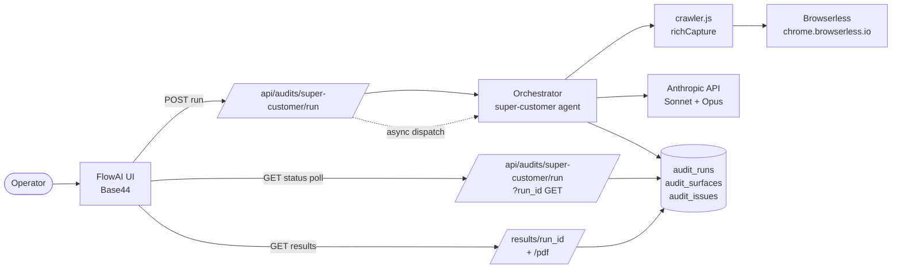

# Super Customer Agent — Capability Spec

The Super Customer Agent is FlowAI's autonomous product-audit capability. It acts as a real customer would: navigates a live product end-to-end, exercises every functional surface it can reach, identifies every break / friction / gap, and proposes specific solutions.

This is a permanent FlowAI capability. It runs against any product (VEU internal or VEUaaS commercial customer's). Tonight's PressAI baseline (`docs/audits/pressai-2026-05-05/`) was the first production use.

---

## What it does



### Five-pass execution per run

1. **Surface discovery** — BFS crawl from a root URL. Browserless renders each page (full JS execution), extracts links, buttons, forms, images, headings. Internal links queued for the next depth level. Bounded by `max_page_count` (default 30, hard cap 200) and depth (`quick` = depth 1, `standard` = depth 2, `full` = depth 4).

2. **Per-surface signal capture** — Per page: HTTP status, page load time, DOM-content-loaded time, console errors (JS exceptions), network errors (failed XHR/fetch), structured surface inventory (links/buttons/forms/images/headings), accessibility heuristics (heading hierarchy ok? alt-text count?), screenshot via Browserless.

3. **Per-surface Claude analysis** — Each surface goes to Claude Sonnet 4.6 with the captured signals + body text. Claude returns: surface_summary, primary_action, issues (severity-classified), per-surface health_score 0-100.

4. **Cross-surface aggregation** — Once all surfaces are analysed, all per-surface findings flow into Claude Opus 4.7 for cross-cutting theme detection, top-issue ranking, effort estimation, and next-week-priority generation.

5. **Persistence + report generation** — Run record + per-surface records + per-issue records persisted (memory today, Supabase tomorrow). Executive summary markdown + action plan markdown written to the bundle directory. PDF report available on demand.

### Severity rubric

| Severity | Meaning | Examples |
|---|---|---|
| **P0** | Blocks core flow | page won't load, primary CTA broken, payment fails, auth missing on private content, sign-up route 404, future-dated privacy policy timestamp |
| **P1** | Blocks important secondary flow | key feature unusable, conversion gap, missing trust signals, GDPR rights only via email, hero CTA splits intent |
| **P2** | Degrades UX | slow load, accessibility violation, confusing copy, broken non-critical link, heading hierarchy out of order |
| **P3** | Cosmetic | typo, alignment, polish, missing alt-text on decorative image |

### Category taxonomy

`functional` · `performance` · `accessibility` · `security` · `data` · `content` · `design` · `trust` · `conversion` · `compliance`

### Effort rubric

| Effort | Definition |
|---|---|
| `trivial` | <15 min for an experienced engineer |
| `small` | <1 hr |
| `medium` | <1 day |
| `large` | >1 day |

---

## What it doesn't do (V1 limitations)

V1 ships tonight. These are V2 enhancements with concrete implementation paths.

| V1 limitation | V2 path | Effort |
|---|---|---|
| **Test account creation skipped** — auth-gated content not exercised | Inject Browserless `/function` code that POSTs to the product's sign-up endpoint with synthetic email + strong password. Capture session cookie. Replay every protected URL with the cookie. | medium |
| **Forms not actually submitted** — UI captured but no real submission | After surface discovery, identify forms with action+method. POST synthetic data via Browserless. Verify response code + success/error UI state. | medium |
| **Stripe test-mode payment surface not walked** | Detect Stripe Elements DOM. Inject `4242 4242 4242 4242` + valid future date + any CVC. Verify completed-payment state. **Abort** if production Stripe keys detected. | medium |
| **axe-core not injected** — using DOM heuristics for accessibility | After page load, inject `axe-core` from CDN, run `axe.run()`, capture violations. | small |
| **Visual regression diffs not run** — no baseline | First run per product establishes baseline screenshots. Subsequent runs diff via pixelmatch. Threshold tunable per surface. | medium |
| **HAR file capture not enabled** | Browserless `/function` endpoint can produce HAR via `page.tracing.start({ path, screenshots: false })`. Persisted as separate object in run bundle. | small |
| **Test data realism limited** — only emails/names today | Per-form-field heuristics: detect `tel`, `address`, `zip`, `cc-number` etc. and supply plausible synthetic values from a curated bank. | small |
| **Run state in memory** — lost across cold starts | Wire to Supabase audit_runs / audit_surfaces / audit_issues tables (migration 0002 already in repo). | small once Supabase activates |

---

## Cost model

### Per-run cost components

| Component | Cost |
|---|---|
| Browserless capture (HTML + screenshot) | ~$0.0008 per page (1 session × 1-3s) |
| Browserless screenshot (when enabled) | already counted above (single function call) |
| Claude Sonnet 4.6 per-surface analysis | ~$0.06 per page (input ~3k tokens, output ~1k tokens) |
| Claude Opus 4.7 cross-surface aggregation | ~$0.30 per audit (one call) |

### Depth presets

| Depth | Pages | Typical cost | Wallclock |
|---|---|---|---|
| `quick` | 5-10 | $0.40 - $0.90 | 1-3 min |
| `standard` | 20-30 | $1.50 - $2.50 | 5-10 min |
| `full` | 75-100 | $5 - $10 | 20-45 min |

### Caps

- **Soft cap** (default $5, configurable per org): a warning note is added to the run when crossed; audit continues.
- **Hard cap** (default $25, never exceeded): audit halts, partial results saved with a "Hard cost cap reached" note.
- Server-side ceiling: `hard_cost_usd` is capped at $25 — an org cannot configure higher without server-side change.

Per-product cost-to-date rolls up via `recordProductAudit()` automatically. Visible at `GET /api/configuration/products/:slug` → `cost_to_date_usd`.

---

## Methodology guarantees

The audit makes the following commitments:

1. **No real PII submitted.** Test data is plausible but clearly synthetic (`Sandbox Sample`, `qa-agent-{ts}@veuai.studio`, test phone ranges). PII fields are flagged + filled with markers, never with real customer data.

2. **No real payments.** Stripe surfaces use test card `4242 4242 4242 4242` only and only when test mode is detected. Production Stripe → surface skipped + flagged as "needs sandbox".

3. **Read-only by default.** V1 doesn't modify any product state. V2's form-submission feature will require explicit `mutate: true` opt-in per audit + a target-host allowlist.

4. **Cost-bounded.** Hard cap $25/run. Soft cap warning. Per-call cost recorded — full audit trail in `cost_events`.

5. **Severity-bound deliverables.** Every issue carries severity, category, reproduction steps, proposed solution, estimated effort. Operators can immediately prioritize and dispatch work — including via the auto-generated Claude Code Backlog.

6. **Multi-tenant isolation.** Every run scoped by `org_id`. With `AUTH_REQUIRED=true`, an org sees only its own audits.

---

## Example findings (from the PressAI 2026-05-05 baseline)

```json
{
  "severity": "P0",
  "category": "functional",
  "title": "/sign-up returns 404",
  "description": "The sign-up route does not render. Every 'Get Started Free' CTA on home and pricing depends on this URL working.",
  "reproduction_steps": [
    "Visit https://ourpublishingai.com",
    "Click 'Get Started Free' in the hero",
    "Observe 404 response from /sign-up"
  ],
  "proposed_solution": "Restore the sign-up route and deploy an actual registration form (email, password, submit) so visitors can register at all",
  "estimated_effort": "small",
  "surface_url": "https://ourpublishingai.com/sign-up"
}
```

```json
{
  "severity": "P0",
  "category": "trust",
  "title": "Privacy policy carries a future-dated 'Last updated: April 11, 2026' timestamp",
  "description": "Reads as placeholder text and undermines the policy's credibility for enterprise evaluators.",
  "proposed_solution": "Correct to the actual current effective date or add an explicit 'scheduled effective date' annotation",
  "estimated_effort": "trivial",
  "surface_url": "https://ourpublishingai.com/privacy"
}
```

```json
{
  "severity": "P1",
  "category": "trust",
  "title": "Quantified hero badges ('9 AI Workflows', '50+ Distribution Channels', '100% AI-Powered Global Reach') are unsourced assertions",
  "description": "Read as marketing claims with no methodology. Hurts credibility for paid SaaS evaluators.",
  "proposed_solution": "Add tooltips/footnotes substantiating each figure or replace the vaguest with concrete claims",
  "estimated_effort": "small",
  "surface_url": "https://ourpublishingai.com/pricing"
}
```

---

## Endpoints reference (productized)

| Method | Path | Purpose |
|---|---|---|
| POST | `/api/audits/super-customer/run` | Dispatch new audit (returns 202 + run_id in <1s) |
| GET | `/api/audits/super-customer/run?run_id=<id>` | Status polling (canonical, colocated with dispatch) |
| GET | `/api/audits/super-customer/status/:run_id` | Path alias (forwards to canonical) |
| GET | `/api/audits/super-customer/results/:run_id` | Full results bundle |
| GET | `/api/audits/super-customer/results/:run_id?format=summary\|issues\|md` | Partial views |
| GET | `/api/audits/super-customer/results/:run_id/pdf` | Print-friendly HTML report (Save as PDF) |
| GET | `/api/audits/super-customer/runs?org_id=&product_id=&status=&limit=` | Audit history list |

Full schema in `docs/SUPER_CUSTOMER_UI_CONTRACT.md`.

---

## Recurring / scheduled audits

When `INNGEST_EVENT_KEY` activates (tomorrow), each product can opt in to weekly automated audits:

```json
{
  "product_id": "saige",
  "audit_schedule": {
    "frequency": "weekly",
    "depth": "standard",
    "objective": "regression detection"
  }
}
```

Inngest's cron-driven function picks up the schedule and dispatches via `/api/audits/super-customer/run`. Results trigger `clearance_check` entries — if P0 count > 0, the product fails clearance until resolved (visible at `/api/governance/dashboard`).

Wiring path:
1. Add `audit_schedule` jsonb column to `products` (migration 0003).
2. Add Inngest function `scheduled-product-audit` triggered by `flowai/audit.scheduled`.
3. Add a daily cron that scans products with `audit_schedule.frequency` matching today, fires events.
4. Resend email notification on completion (delta vs prior run).

---

## Files

```
/api/_lib/superCustomerAgent.js                — agent core (BFS crawl, per-surface analysis, aggregation)
/api/_lib/crawler.js                           — richCapture (Browserless /function) + screenshot
/api/audits/super-customer/run.js              — POST dispatch + GET status polling
/api/audits/super-customer/status/[run_id].js  — path alias
/api/audits/super-customer/results/[run_id].js — full results bundle (with format= options)
/api/audits/super-customer/results/[run_id]/pdf.js — print-friendly HTML report
/api/audits/super-customer/runs.js             — audit history list
/supabase/migrations/0002_super_customer.sql   — audit_runs + audit_surfaces + audit_issues
/docs/SUPER_CUSTOMER_AGENT.md                  — this file
/docs/SUPER_CUSTOMER_UI_CONTRACT.md            — UI wiring spec for Base44
/docs/SUPER_CUSTOMER_PRICING.md                — VEUaaS commercial tier strategy
/docs/audits/pressai-2026-05-05/               — first production run output (PressAI baseline)
```
