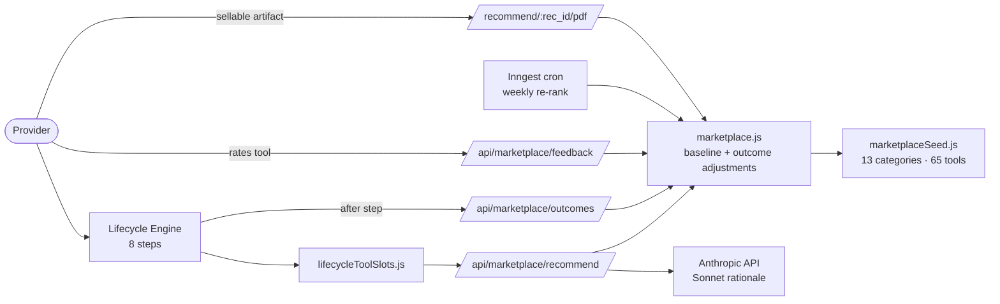
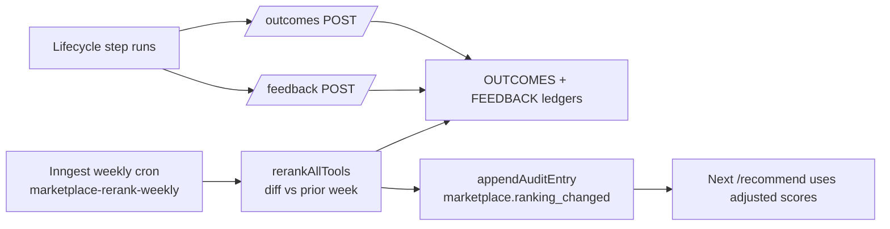

# Tool Intelligence Marketplace — Capability Spec

The Tool Intelligence Marketplace is FlowAI's contextual tool-recommendation capability. At each step of FlowAI's 8-step product lifecycle, it evaluates the available tools (hosting, databases, auth, payments, AI models, observability, …) and recommends the best one for *this* provider building *this* app for *this* end customer.

It is multi-tenant, gets smarter as outcome data accumulates, and is designed for both autonomous runs (top pick is used automatically) and human-in-the-loop runs (provider sees top 3 and can override).

This is a permanent FlowAI capability. It mirrors the architecture of the Super Customer Agent (Phases shipped via `Marketplace: P1..P8` commits).

---

## What it does



### Six-pass recommendation flow

1. **Category resolution** — The lifecycle step (1-8) maps to one or more categories via `STEP_CATEGORY_PRIORITY` in `lifecycleToolSlots.js`. Step 3 (Build) → `[hosting, databases, auth, storage, ai_llm]`; step 7 (GTM) → `[email, analytics, gtm, payments]`.

2. **Candidate filtering** — For each category, list active tools. Filter out org-blocked slugs, archived tools, deprecated tools, and any that violate hard sovereignty constraints from `provider_preferences`.

3. **Baseline scoring** — Each candidate is scored across 7 dimensions (cost, quality, latency, integration_complexity, data_residency, vendor_health, lock_in_risk) from static facts in `marketplaceSeed.js`. Region-aware: a Paystack scores 95+ for Africa, 30 for US.

4. **Outcome adjustment** — When ≥3 prior runs exist for a tool, baseline scores blend with observed outcomes (success rate → quality, P95 latency → latency, $/run → cost). Below the threshold, baseline-only scoring is used and flagged as "limited evidence".

5. **Weighted ranking** — Default weights are derived from request context (region, scale, sensitivity, end-customer size, prefer_low_cost / prefer_high_quality / prefer_no_lock_in / prefer_data_sovereignty). Provider's saved overrides win. Weights renormalize to sum 1.

6. **Rationale generation** — Top 3 short-listed candidates go to Claude Sonnet 4.6 which returns a 1-2 sentence rationale + tradeoffs per tool. The full record is persisted via `recordRecommendation` for traceability.

### The 7 ranking dimensions

| Dimension | What it captures | Static signal | Outcome signal |
|---|---|---|---|
| `cost` | Price-to-value relative to tier | `pricing_model`, `starting_paid_tier_usd`, `has_free_tier` | observed avg `cost_usd` per run vs expected |
| `quality` | Does it actually work | `vendor_health`, `compliance_certs` | `success_rate`, `provider_satisfaction`, observed `quality_score` |
| `latency` | Speed for end-users | implied by category + region | observed `p95_latency_ms` |
| `integration_complexity` | Effort to wire up | `integration_complexity 1-5`, `setup_time_estimate_minutes` | (not adjusted) |
| `data_residency` | Region/sovereignty fit | `data_residency_options`, `compliance_certs`, `region_strengths[region]` | (not adjusted) |
| `vendor_health` | Will they be around in 2 years | `last_funding_round`, `public_incident_frequency`, `open_source` | (not adjusted) |
| `lock_in_risk` | How easy to leave | `data_export_ease`, `self_hostable`, `open_source` | (not adjusted) |

Static-only dimensions are deliberate — they don't drift with usage and need vendor research to update.

---

## Surface area

### Provider-facing endpoints (Phase 6)

| Endpoint | Method | Purpose |
|---|---|---|
| `/api/marketplace/categories` | GET | Browse the 13-category taxonomy. `?step=N` filters; `?include_counts` adds tool counts. |
| `/api/marketplace/tools` | GET | Browse tools with current rankings. `?category`, `?region`, `?slug`, `?include_archived`. |
| `/api/marketplace/tool-history/:slug` | GET | Drill into a tool: outcomes ledger, ranking movement, evidence. Org-scoped. |
| `/api/marketplace/recommend` | POST | Get a contextual recommendation for a step + category. Body: `step_number`, `category`, `context`, `top_n`. |
| `/api/marketplace/outcomes` | POST/GET | Record/list observable outcomes (cost, latency, success). |
| `/api/marketplace/feedback` | POST/GET | Record/list provider's qualitative rating (1-5 + comment + tags). |
| `/api/marketplace/recommend/:rec_id/pdf` | GET | Buyer-grade brief for a recommendation. |

### Lifecycle Engine integration (Phase 5)

The engine doesn't hit `/api/marketplace/recommend` directly — it goes through `lifecycleToolSlots.js`:

```js
import { recommendSlotsForStep } from './lifecycleToolSlots.js';

const result = recommendSlotsForStep({
  stepNumber: 3,                  // Build
  orgId: 'veu-ai-studio',
  productId: 'pressai',
  runId: 'run_xyz',
  region: 'africa',
  scale: 'production',
  sensitivity: 'medium',
});
// → { step_number: 3, slots: [{ category_id, top_pick, alternatives, recommendation_id }, ...] }
```

`STEP_CATEGORY_PRIORITY` ensures the engine considers the right categories at each step. `LIFECYCLE_DEFAULT_WEIGHTS` favour quality (0.25) + integration_complexity (0.20) for production builds.

### Admin / ops

| Endpoint | Method | Purpose |
|---|---|---|
| `/api/marketplace/admin/rerank` | POST | Manual trigger for the weekly re-rank pass. Requires `x-flowai-admin-key`. |

---

## Continuous learning loop



- **Outcomes** are observable metrics emitted by the lifecycle engine after each step (cost_usd, latency_ms, success, quality_score, error_type).
- **Feedback** is the provider's subjective rating after using a tool (1-5 stars + comment + tags + would_recommend). Feedback shadow-writes a satisfaction-only outcome so the ranker picks it up without a separate code path.
- **Re-rank** runs every Monday 03:00 UTC via Inngest. Walks every tool, recomputes adjusted rankings, emits an audit-log entry per dimension change ≥5 points so providers see ranking shifts over time.
- **Evidence threshold:** 3 runs minimum before outcome-adjusted scoring kicks in. Below that, baseline-only.

---

## Multi-tenancy

Every persisted row carries `org_id` + `product_id` + `lifecycle_run_id`. Cross-org reads are gated:

- `/recommend` only sees the caller's org's outcomes when adjusting baselines (V2 — currently global).
- `/tool-history/:slug` is org-scoped by default; `?org_scope=all` requires `x-flowai-admin-key`.
- `/feedback` GET only returns the caller's org's feedback.
- `/recommend/:rec_id/pdf` returns 404 if the recommendation's `org_id` doesn't match the caller's.

Provider preferences (`marketplace_provider_preferences` table) hold per-org overrides:

- `weight_overrides` — custom dimension weights that win over context-derived defaults
- `preferred_tool_slugs` / `blocked_tool_slugs` — hard inclusion/exclusion lists
- `data_sovereignty_required` — list of regions; tools without matching residency are filtered out

---

## V1 vs V2 (the supabase migration)

V1 (today): in-process Maps + Arrays. Single Vercel function instance hosts the ledger. Cross-instance memory loss is mitigated by the same warm-affinity pattern used elsewhere (POST + GET status colocated in the same handler).

V2 (`/supabase/migrations/0004_tool_marketplace.sql`): every Map becomes a Postgres table, every helper becomes a SELECT/INSERT. RLS scaffolded. `vector(1024)` embedding columns ready for semantic search of "tools like X". The seed file (`marketplaceSeed.js`) is the single source of truth — `/api/admin/seed-marketplace` pushes it into the tables. Adding a tool is one append to `TOOLS` and one re-run of seed.

---

## Filed under

- Schema: `/supabase/migrations/0004_tool_marketplace.sql`
- Seed: `/api/_lib/marketplaceSeed.js`
- Engine: `/api/_lib/marketplace.js`
- Lifecycle integration: `/api/_lib/lifecycleToolSlots.js`
- Re-rank job: `/api/_lib/jobs/marketplaceRerank.js`
- Inngest cron: `/api/_lib/inngest.js` (`marketplace-rerank-weekly`)
- Endpoints: `/api/marketplace/*`
- Taxonomy reference: `docs/MARKETPLACE_TAXONOMY.md`
- Provider integration guide: `docs/MARKETPLACE_PROVIDER_GUIDE.md`
